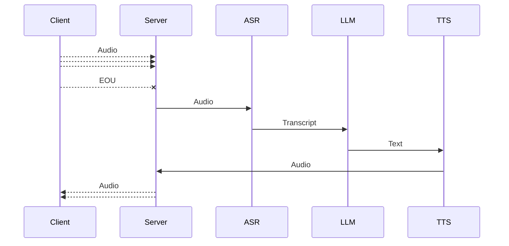
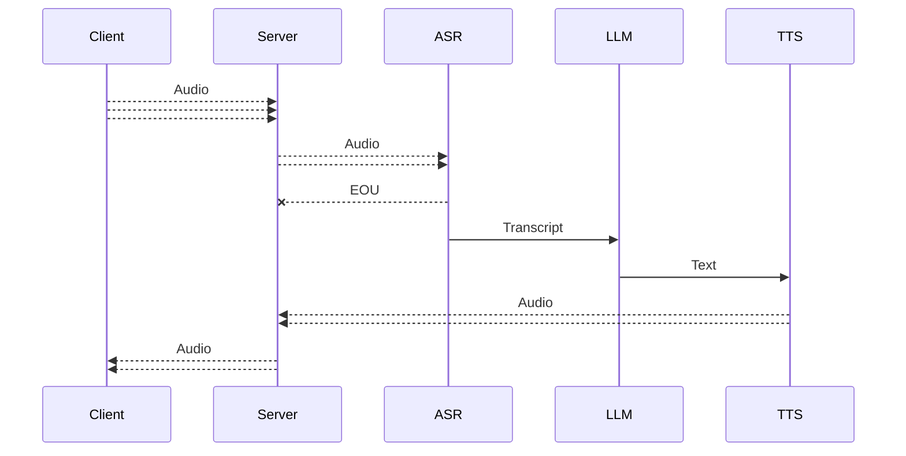
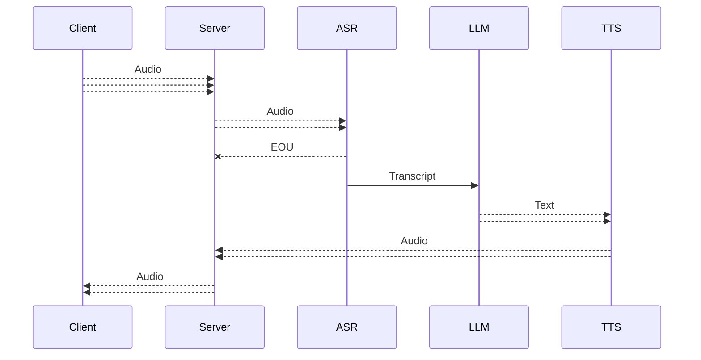
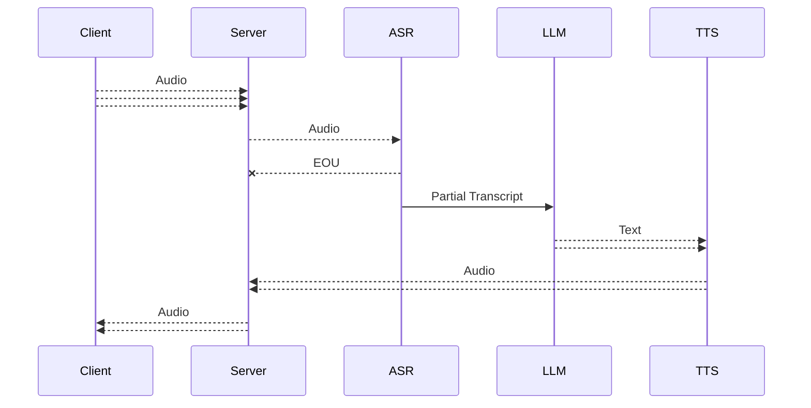

Well this is just a simple bot

To stream all you want

---
## Roadmap

### v0

- Streaming input and output to/from the bot
- No streaming within the bot

### v1

- Streaming input and output to/from the bot

> - **Streaming input to ASR and endpointing (~EOU detection)**
> - **Streaming output from TTS**

### v2

- Streaming input and output to/from the bot
- Streaming input to ASR and endpointing (~EOU detection)

> - **Streaming output from LLM** 
> - **Streaming input and output to/from TTS**

### v3

- Streaming input and output to/from the bot
- Streaming input to ASR and endpointing (~EOU detection)

  > - **Optimised endpointing : partial transcripts are streamed to LLM**
- Streaming output from LLM 
- Streaming input and output to/from TTS

